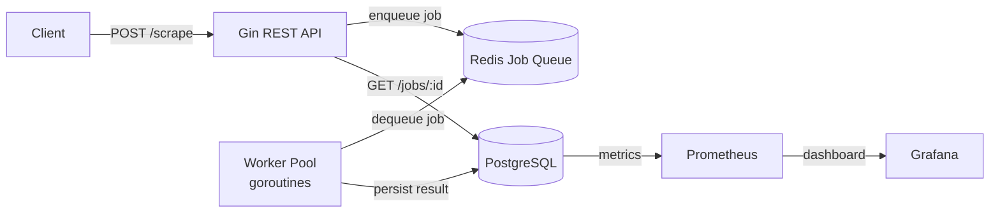

# Web Gobbler

[](https://goreportcard.com/report/github.com/Masralai/web-gobbler)
[](https://opensource.org/licenses/MIT)
[](https://golang.org/dl/)

Distributed web scraping service built with Go (Gin), Redis, PostgreSQL, and Docker.

Submit scraping jobs via HTTP, process them asynchronously through a worker pool, and retrieve results via a REST API. Horizontally scalable on AWS ECS Fargate.

> [!TIP]
> **Get started in 2 commands:**
>
> ```bash
> docker compose up -d
> curl http://localhost:8080/api/v1/health
> ```
>
> Full run guide (crawl, browser, LLM extract, tests): **[docs/how-to/run.md](docs/how-to/run.md)**. Product phases: **[spec.md](spec.md)**.
> For a local AWS-shaped sandbox ($0): **`./scripts/floci-up.sh`** — see [Floci sandbox](#floci-sandbox-local-aws-0).

## Architecture



> [!NOTE]
> Jobs flow: HTTP 202 accepted → enqueued in Redis → picked up by a worker → result persisted to PostgreSQL. All workers share the same queue and coordinate via Redis.

## Features

- Configurable extraction — `markdown`, `html`, `raw_html`, links, headers, paragraphs
- Crawl / map — same-origin multi-page jobs and URL discovery
- Optional JS render — `options.render_js` with compose profile `browser`
- Optional LLM extract — `POST /jobs/:id/extract` when `LLM_API_KEY` is set (not an agent)
- Async job processing — non-blocking HTTP responses, workers pick jobs from Redis
- Per-domain rate limiting — 2 req/s default per hostname
- Retry with exponential backoff — 100ms × 2ⁿ, configurable max attempts
- Metrics — Prometheus counters/histograms/gauges, Grafana dashboard
- Pagination — list jobs with status filtering and pagination
- Health checks — liveness/readiness with DB + Redis status
- SSRF protection — private IP ranges blocked, max 5 redirects enforced
- Security hardening — body size limit (1 MB), security headers, sentinel errors
- Production-ready — distroless Docker images, Terraform for AWS, CI/CD

## Local development

### Prerequisites

- Go 1.26+
- Docker and Docker Compose

### Start services

```bash
docker compose up -d
```

This starts: API (port 8080), worker, PostgreSQL (5432), Redis (6379), Prometheus (9090), Grafana (3000).

> [!WARNING]
> Ports 8080, 5432, 6379, 9090, and 3000 must be free on the host. Run `docker compose ps` to verify all services are healthy.

### Verify

```bash
curl http://localhost:8080/api/v1/health
# also: curl http://localhost:8080/health
```

```json
{"status":"ok","db":"ok","redis":"ok","version":"1.0.0"}
```

Migrations run automatically on API/worker startup (`store.Migrate`). No manual SQL step required for Compose.

See **[docs/how-to/run.md](docs/how-to/run.md)** for scrape/crawl/map examples, browser profile, LLM extract, and the feature-matrix script.

## Floci sandbox (local AWS, $0)

Practice the real AWS resource graph (VPC → RDS → ElastiCache → ECR → ECS) against a local [Floci](https://floci.io) endpoint — **no AWS account and no cloud spend**. This is **local-only**; it does not deploy to real AWS.

Normal `docker compose up -d` is unchanged. The sandbox uses the `sandbox` compose profile and `deploy_mode=floci`.

### Prerequisites

- **Docker** (Compose v2) with the engine running
- **Terraform** >= 1.6
- **AWS CLI** v2 (talks to Floci at `http://localhost:4566` with dummy `test`/`test` credentials)
- `curl`, `bash`, `python3` (smoke-test JSON parsing)

### Run

```bash
./scripts/floci-up.sh
# optional end-to-end scrape:
./scripts/floci-up.sh --smoke-test
```

The script starts Floci, applies Terraform (`deploy_mode=floci`), builds/pushes api+worker images to the local registry, migrates Postgres, and polls `GET http://localhost:8080/api/v1/health`.

### What it provisions

Against Floci’s LocalStack-compatible API (backed by real Postgres, Valkey, Docker ECS tasks, and a local ECR registry): VPC/subnets/SGs, RDS PostgreSQL, ElastiCache/Valkey, ECR repos, ECS cluster + api/worker services (bridge/`hostPort: 8080` in the sandbox). ALB and worker autoscaling are omitted under Floci — see the downgrade table below.

### Teardown

```bash
docker compose --profile sandbox down -v
```

### Negotiated downgrades

Sandbox deviations from prod Terraform are recorded in the negotiated-downgrade table in **[docs/PRD_FLOCI_SANDBOX.md](docs/PRD_FLOCI_SANDBOX.md)** (Fidelity strategy section). Also see **[docs/FLOCI_SANDBOX.md](docs/FLOCI_SANDBOX.md)**.

## API documentation

Base URL: `/api/v1`

### POST /scrape

Submit a scraping job.

**Extract types:** `links`, `headers`, `paragraphs`, `markdown`, `html`, `raw_html` (combine freely).

```json
{
  "url": "https://example.com",
  "extract": ["markdown", "links"],
  "options": {
    "timeout_seconds": 15,
    "max_retries": 3,
    "follow_redirects": true
  }
}
```

| Status | Description |
|--------|-------------|
| `202 Accepted` | Job queued — returns `job_id` and `poll_url` |
| `400 Bad Request` | Invalid URL, extract type, or option bounds |

Response `202 Accepted`:

```json
{
  "job_id": "f47ac10b-58cc-4372-a567-0e02b2c3d479",
  "status": "queued",
  "created_at": "2025-09-01T10:32:00Z",
  "poll_url": "/api/v1/jobs/f47ac10b-58cc-4372-a567-0e02b2c3d479"
}
```

### POST /crawl

Same-origin BFS crawl (no robots.txt in v1). Defaults: `max_pages=10`, `max_depth=2` (caps 100 / 5).

```json
{
  "url": "https://example.com",
  "extract": ["markdown"],
  "options": { "max_pages": 10, "max_depth": 2 }
}
```

Completed `results` include `pages[]`, `pages_crawled`, `pages_skipped`.

### POST /map

URL discovery only. Defaults: `max_urls=50`, `max_depth=2` (caps 500 / 5).

```json
{
  "url": "https://example.com",
  "options": { "max_urls": 50, "max_depth": 2 }
}
```

Completed `results.urls` is a string array.

### POST /jobs/:id/extract

Optional LLM schema extract (requires `LLM_API_KEY` on API). Returns `501` if unset. See [docs/how-to/llm-extract.md](docs/how-to/llm-extract.md).

### JS rendering

Pass `"options": { "render_js": true }` on scrape/crawl. Needs browser worker: `docker compose --profile browser up`. See [docs/how-to/browser-render.md](docs/how-to/browser-render.md).

### GET /jobs/:id

Poll job status and retrieve results.

| Status | Description |
|--------|-------------|
| `200 OK` | Job found — returns status, results, or error |
| `404 Not Found` | Invalid or unknown job ID |

Response `200 OK` — completed:

```json
{
  "job_id": "f47ac10b-...",
  "status": "completed",
  "url": "https://example.com",
  "created_at": "2025-09-01T10:32:00Z",
  "completed_at": "2025-09-01T10:32:03Z",
  "duration_ms": 1240,
  "results": {
    "links": ["https://example.com/about"],
    "headers": ["Welcome to Example"],
    "paragraphs": ["This domain is for use in illustrative examples..."]
  },
  "meta": {
    "links_count": 1,
    "headers_count": 1,
    "paragraphs_count": 1,
    "http_status": 200,
    "retries_used": 0
  }
}
```

Response `200 OK` — failed:

```json
{
  "job_id": "f47ac10b-...",
  "status": "failed",
  "error": "target returned 403 after 3 retries",
  "created_at": "2025-09-01T10:32:00Z",
  "failed_at": "2025-09-01T10:32:08Z"
}
```

> [!TIP]
> Poll the `poll_url` returned in the `POST /scrape` response every 2-3 seconds until the status changes from `queued`/`processing` to `completed` or `failed`.

### GET /jobs

List jobs with pagination and optional status filter.

**Query params:** `page` (default 1), `limit` (default 20, max 100), `status` (queued|processing|completed|failed)

| Status | Description |
|--------|-------------|
| `200 OK` | Returns paginated job list |

Response `200 OK`:

```json
{
  "jobs": [
    {
      "job_id": "f47ac10b-...",
      "url": "https://example.com",
      "status": "completed",
      "created_at": "2025-09-01T10:32:00Z",
      "updated_at": "2025-09-01T10:32:03Z"
    }
  ],
  "total": 1,
  "page": 1,
  "limit": 20
}
```

### DELETE /jobs/:id

Cancel a queued job.

| Status | Description |
|--------|-------------|
| `200 OK` | Job cancelled |
| `409 Conflict` | Job cannot be cancelled (already processing or done) |
| `404 Not Found` | Invalid or unknown job ID |

Response `200 OK`: `{"status": "cancelled"}`

### GET /health

Liveness and readiness check.

| Status | Description |
|--------|-------------|
| `200 OK` | All dependencies reachable |
| `503 Service Unavailable` | DB or Redis unreachable |

Response `200 OK`:

```json
{"status":"ok","db":"ok","redis":"ok","version":"1.0.0"}
```

Response `503`:

```json
{"status":"degraded","db":"degraded","redis":"ok","version":"1.0.0"}
```

> [!IMPORTANT]
> Error details are logged server-side only. The health endpoint returns generic `"degraded"` status to avoid leaking internal state.

## Running tests

```bash
# Unit tests (33 tests across scraper + API handlers)
go test -race -cover ./...

# Integration tests (requires Docker for PostgreSQL + Redis containers)
docker compose up -d postgres redis
go test -tags=integration -race -v ./test/integration/...
docker compose down

# Load tests (requires k6: brew install k6)
k6 run test/load/scenario.js

# Vulnerability check
go run golang.org/x/vuln/cmd/govulncheck@latest ./...
```

> [!NOTE]
> Integration tests use testcontainers-go and spin up real PostgreSQL + Redis containers. Ensure Docker is running and the `integration` build tag is set.

## Production deployment

### Prerequisites

- AWS account with permissions for ECS, ECR, RDS, ElastiCache, IAM
- Terraform installed
- Docker installed

### Infrastructure

```bash
# Initialize Terraform
cd terraform
terraform init

# Review and apply
terraform plan
terraform apply
```

This provisions VPC, RDS PostgreSQL, ElastiCache Redis, ECR repositories, ECS Fargate cluster with API and worker services, ALB, and auto-scaling.

> [!WARNING]
> Terraform creates real AWS resources. Review the plan carefully before applying. Estimated monthly cost: ~$60–100 for the full stack.

### CI/CD

Push to `main` triggers the GitHub Actions pipeline:

1. Lint and vet
2. Vulnerability check (govulncheck)
3. Unit tests
4. Integration tests
5. Build Docker images (api + worker)
6. Push to ECR
7. Register new ECS task definitions
8. Rolling deploy (api → worker)
9. Health check

### Required GitHub secrets

| Secret | Description |
|--------|-------------|
| `AWS_ACCESS_KEY_ID` | IAM user access key |
| `AWS_SECRET_ACCESS_KEY` | IAM user secret key |
| `ALB_DNS` | ALB DNS name for health checks |

## Environment variables

### Server

| Variable | Default | Required | Description |
|----------|---------|----------|-------------|
| `PORT` | `8080` | No | API server port |
| `LOG_LEVEL` | `INFO` | No | Log level (DEBUG, INFO, WARN, ERROR) |

### Database & Queue

| Variable | Default | Required | Description |
|----------|---------|----------|-------------|
| `DATABASE_URL` | — | **Yes** | PostgreSQL connection string |
| `REDIS_URL` | — | **Yes** | Redis connection string |

> [!WARNING]
> `DATABASE_URL` and `REDIS_URL` have no defaults. The server will exit immediately if either is unset. Never hardcode credentials.

### Scraper

| Variable | Default | Required | Description |
|----------|---------|----------|-------------|
| `DEFAULT_TIMEOUT_SEC` | `10` | No | HTTP timeout for scrapers |
| `DEFAULT_MAX_RETRIES` | `3` | No | Max retry attempts per job |
| `SCRAPER_RATE_LIMIT` | `2` | No | Per-domain requests per second |
| `WORKER_CONCURRENCY` | `5` | No | Goroutines per worker |

### Observability

| Variable | Default | Required | Description |
|----------|---------|----------|-------------|
| `GOSCRAPE_ENVIRONMENT` | `prod` | No | Environment label for CloudWatch metrics |

## Project structure

```dir
├── cmd/
│   ├── api/             main.go — Gin server entrypoint
│   └── worker/          main.go — Worker pool entrypoint
├── internal/
│   ├── api/             Handlers, middleware, types, validation
│   ├── scraper/         Core extraction logic (goquery)
│   ├── queue/           Redis enqueue/dequeue helpers
│   ├── store/           PostgreSQL CRUD (pgx)
│   └── metrics/         Prometheus metric registration
├── migrations/          SQL migration files
├── docker/              Dockerfiles, Prometheus config, Grafana dashboard
├── docs/                Specs, how-tos, Floci sandbox PRD
├── scripts/             Bootstrap helpers (e.g. floci-up.sh)
├── terraform/           AWS / Floci infrastructure as code
├── test/
│   ├── integration/     Testcontainers integration tests
│   └── load/            k6 load test scripts
├── .github/workflows/   CI/CD pipeline
├── docker-compose.yml   Local development (+ sandbox profile)
└── README.md
```
